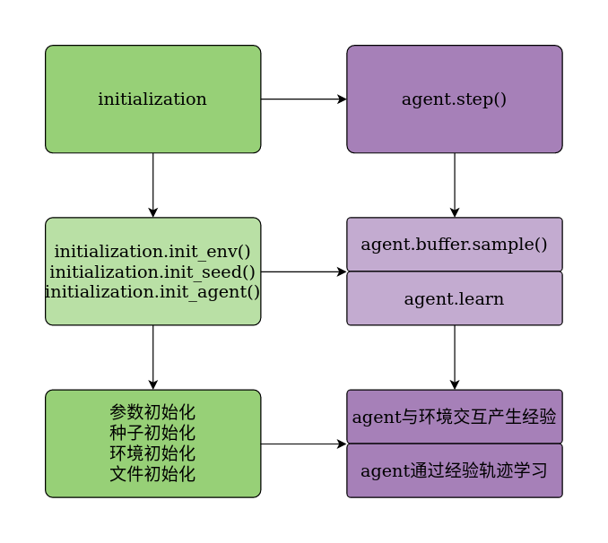

# 文件之间的相互关系如下：

# 注：

我的仓库中所有的复现论文的文件形式基本都相同（所以看懂一个，基本上就是在这个框架上修改几个Trick使agent的表现更好），当然只是为了快速学习算法的中心思想，其实忽略了很多性能山上的问题，比如不应该每探索一步就马上更新一次网络，这会改变ReplayBuffer中的数据分布，使训练不稳定，而[小雅Elegant](http://link.zhihu.com/?target=https%3A//github.com/Yonv1943/ElegantRL)考虑到了很多诸如此类的问题，小雅真的是最简洁的分布式训练的RL库。

当我们快速的理解一个算法的本质，我们会知道哪些参数会影响agent的奖励曲线，进而更好的去调参，并且知道它可以应用的场景以及局限性。当这个过程完成后，那么一些RL分布式标准库，无非就是将一些代码标准化，以及可以最大化利用硬件资源等等。所以，我也准备更新一个自己的库，希望在elegant的基础上做一些我认为适合自己的东西（下面的不是elegant的缺点，只是有很多地方不能满足我自己的需求）。比如：

- 小雅为了保持简洁日志记录很简单，但是我想把所有的数据都导出为csv文件，以便对数据的处理（画一些花里胡哨的图，忽悠审稿人）

- 小雅只追随最先进的东西，比如issam，但是，大多数我们的模拟环境都不支持在GPU的向量环境，所以就无法进行多组环境的并行训练。这个方面我自己尝试的修改了下，可能还有点问题

其他的库在多进程上的处理真的很繁琐，比如SEED-RL基于RPC的，Sample-Factory是基于共享内存的、Event的（阅读部分源码，如果到时候做的中文标记完了，就放出来看看吧。。。）。还有商汤开源的[open-di engine](https://github.com/opendilab/DI-engine)这个库好多地方都值得我们学习，比如对ReplayBuffer的处理可以应对很多算法，如R2D3（burn-in）等等。

